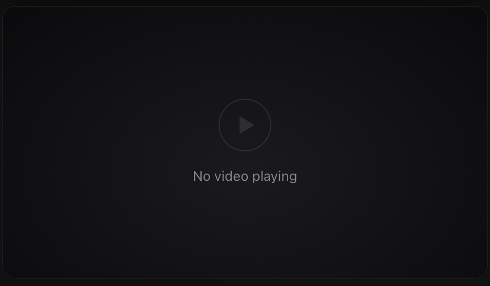
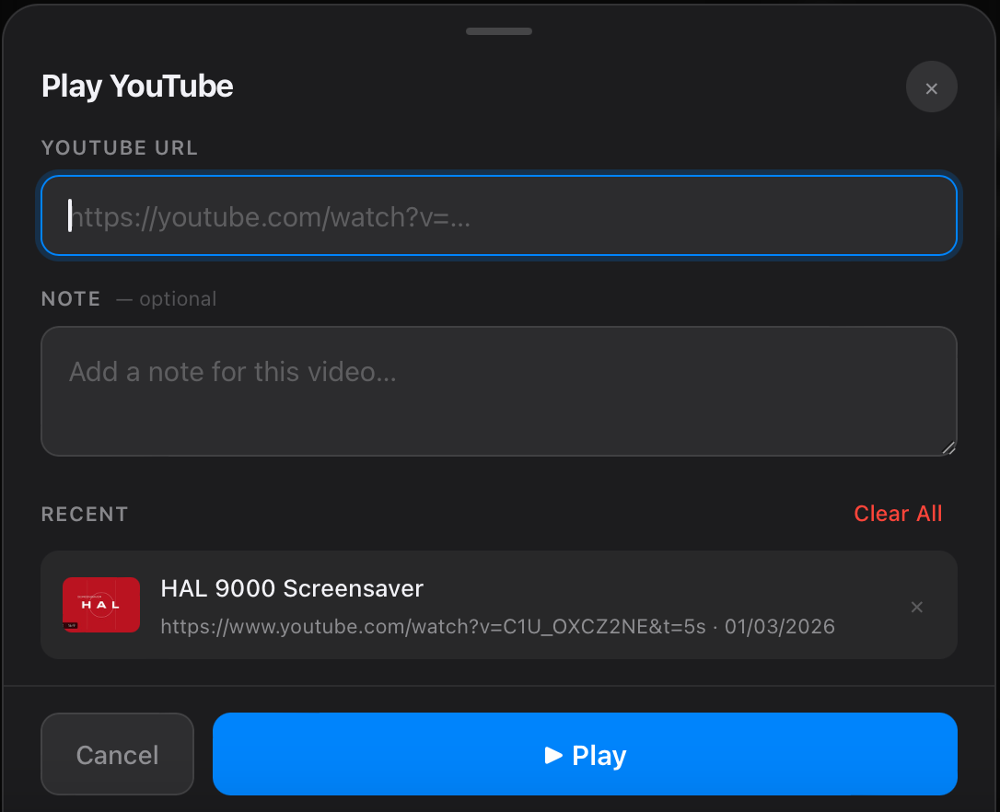
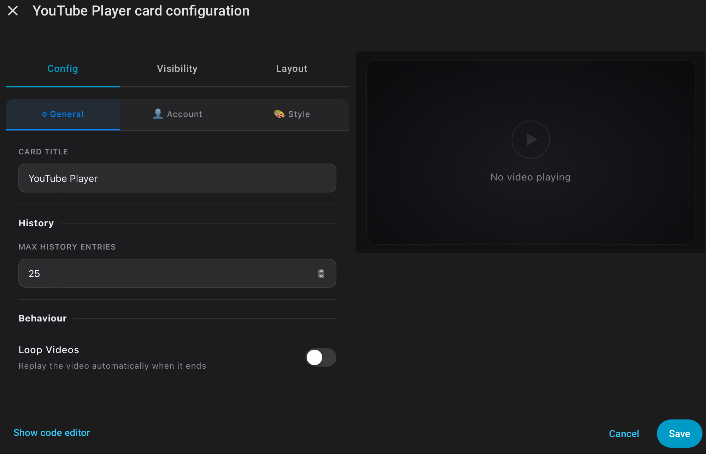

# YouTube Player Card

A minimal, clean YouTube player card for Home Assistant Lovelace. Play any YouTube URL directly inside your dashboard — just hover or tap the card to reveal the play button, paste a URL, and go.

---

---

## Features

- **Zero configuration** — works out of the box, no entities needed
- **Hover/tap to reveal** — clean full-screen player with a discreet icon that appears on hover (desktop) or tap (mobile)
- **URL history** — remembers up to 30 recent videos with thumbnails and optional notes
- **Optional Google sign-in** — connect your YouTube account for playlist access
- **Visual editor** — friendly 3-tab editor for all settings, no YAML required
- **Accent colour** — choose from 8 presets or pick any colour

---

---

## How to use

1. Add the card to your dashboard
2. Hover over it (or tap on mobile) — a small **▶ YouTube icon** appears in the bottom-right corner
3. Click the icon and paste any YouTube URL
4. Optionally add a note, then click **▶ Play**

Your recent videos are saved so you can replay them instantly from the history list.

---

---

## Installation

Search for **YouTube Player Card** in HACS → Frontend, or click the button above.
